# Count Calories redesign — final report

**Status:** COMPLETE

**Closure milestone:** FINAL-001

**Post-closure milestones:** COMPETITOR-GAP-001, BACKLOG-CLOSURE-001

**Date:** 2026-08-20

## Outcome

Count Calories moved from functional but flat calorie logging to coherent native product centered on fast, truthful daily decisions:

```text
Today | Weight | Progress | Settings
```

Program meets redesign Definition of Done: primary journeys implemented and retained, normal and stress layouts inspected, safety and persistence boundaries hardened, independent critical/high review converged, final app-hosted/hostless/UI gates passed, and current documentation agrees.

## Baseline → final

| Area | Baseline | Final |
|---|---|---|
| Daily answer | Percentage and flat intake rows competed with tools | Remaining/over calories leads; eaten/goal, water, food-log evidence, nutrition, and four meal summaries follow |
| Food logging | Hidden/limited selection and keyboard-heavy correction | Search-first local/remote discovery, recent/frequent shortcuts, scanner/manual fallback, exact fields, presets, and keyboard-free ±10/±1 |
| Multi-food meals | One item per flow | Typed or on-device dictated description → provisional editable verified rows → one atomic confirmation |
| Nutrition | Calories only | Immutable logged macro/fiber snapshots, explicit coverage, measured facts, and transparent adult references without opaque score |
| Weight/history | Sparse combined history | Dedicated Weight Log CRUD, separate target-aware analytics, and date-first Food Diary with truthful known-item add/edit/copy/delete/undo plus legacy limitations |
| Plan | Manual goal fields | Explainable calculated/adaptive plan plus optional user-entered macro/fiber targets that retain general references and never alter calorie evidence |
| Reminders | Fixed/basic controls | Independent exact meal, water, daily/weekly weight intent; permission-aware scheduling and retryable errors |
| Auxiliary surfaces | Secondary consumed-calorie presentation | Goal-aware medium widget and explicit Live Activity matching Today hierarchy |
| Robustness | Normal-state layouts | Light/dark, normal/AX3, small/large, empty/dense/extreme fixtures and deterministic UI coverage |

Baseline evidence remains under [`screenshots/baseline/`](screenshots/baseline/). Final evidence is indexed in [`SCREENSHOTS.md`](SCREENSHOTS.md).

## Final representative evidence

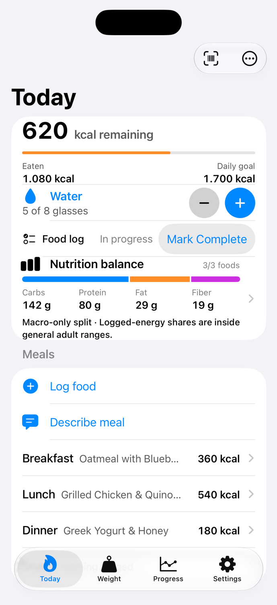

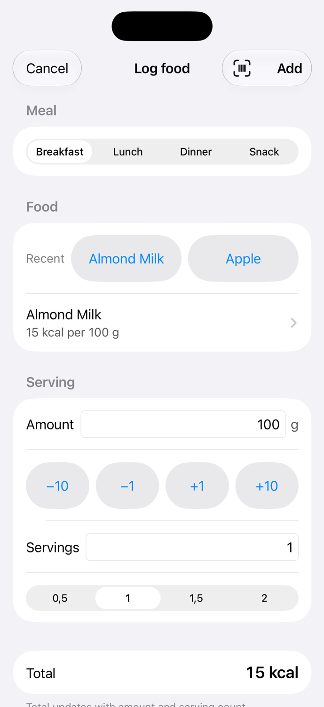


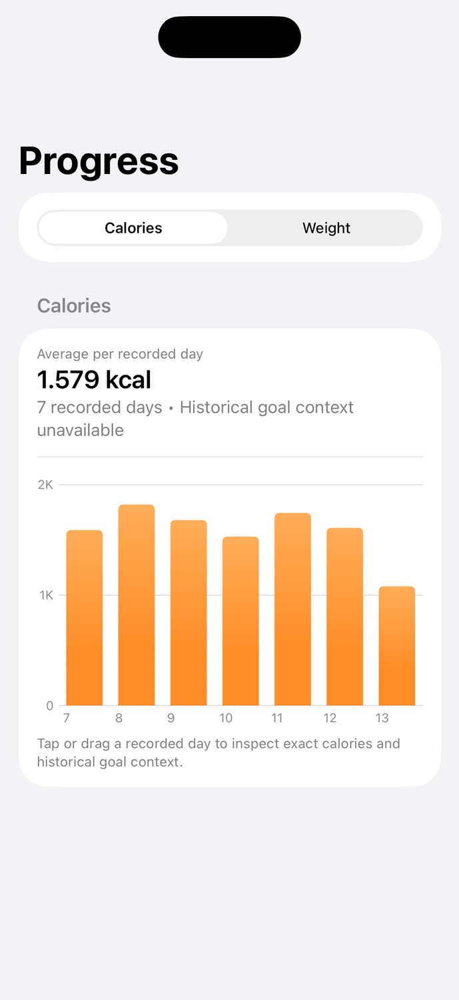

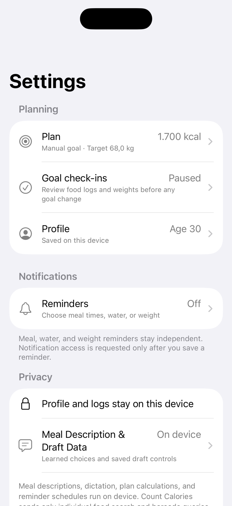

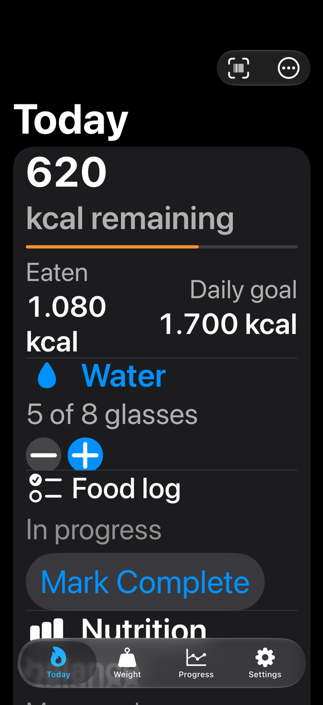

Widget and Live Activity evidence:


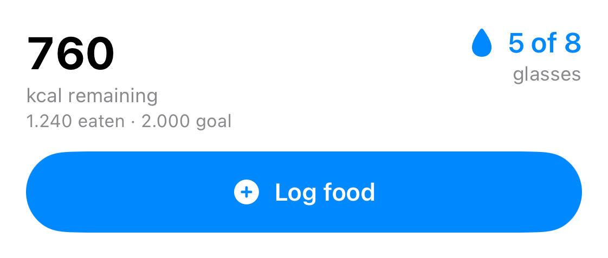

## Primary journey proof

Final walkthrough and deterministic fixtures cover:

1. Today status, water, food-log evidence, Nutrition, meals, and root navigation.
2. Log food with default Almond Milk at 100 g / 15 kcal.
3. Bulk meal review with editable query, amount, source, and atomic total.
4. Empty/populated Weight Log and calorie/weight Progress.
5. Progress calorie selection → View Day → meal-grouped Food Diary → known-snapshot add/edit/copy/delete/undo → adjacent recorded day.
6. Settings → Plan and Settings → Reminders.
7. Widget and explicit Live Activity.
8. Accessibility 3 dark Today and Food Diary reachability.

Default Almond Milk arithmetic is protected at domain and UI levels: one save changes Today by exactly **+15 kcal**.

## Post-closure competitor gap

Fresh category reassessment selected date-first historical food detail as clearest retained gap. COMPETITOR-GAP-001 adds **View Day** from a selected Progress calorie point into a native read-only diary with localized date, assessed calorie completeness, meal ordering, immutable logged snapshots, and previous/next recorded-day navigation. It does not mix food, water, and weight history or imply historical mutation/copy.

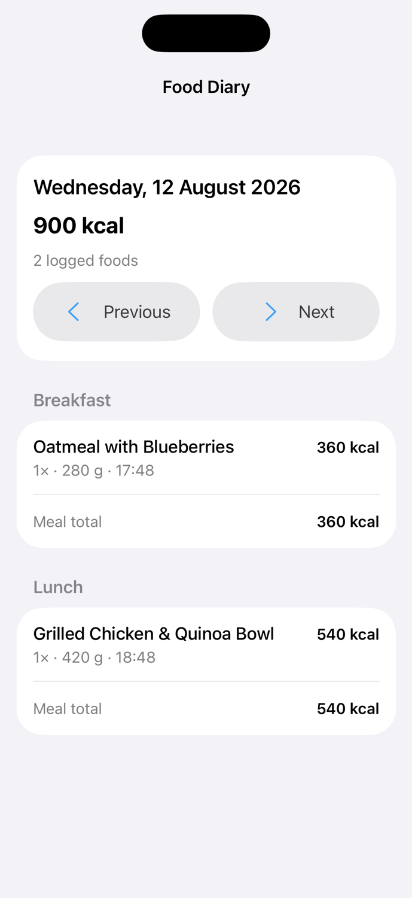

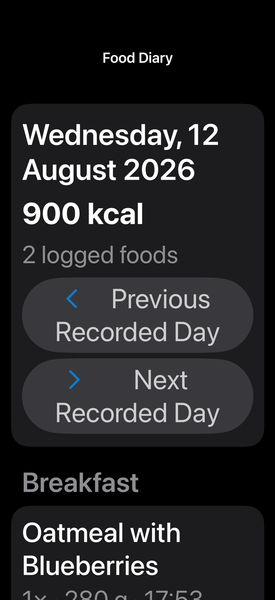

Research and initial contract: [`../docs/historical-calorie-diary-assessment.md`](../docs/historical-calorie-diary-assessment.md). Experiment: [`experiments/COMPETITOR-GAP-001.md`](experiments/COMPETITOR-GAP-001.md).

## Finite backlog closure

BACKLOG-CLOSURE-001 resolved every worthwhile candidate still mentioned in project Markdown:

- known item snapshots support explicit historical add/edit/copy/delete/undo through one atomic coordinator; legacy aggregates stay visible but cannot be falsely edited/copied;
- optional personal carbohydrate/protein/fat/fiber targets remain user-entered, local, distinct from general references, and coverage-gated;
- frequently logged foods derive from local history without a persistent index;
- app and widget use one complete/incomplete calorie accessibility contract;
- Today, diary, widget, reminders, and Live Activity synchronize through extracted external-surface orchestration after writes.

Unsupported candidates were closed rather than silently deferred: HealthKit/accounts/cross-device sync, streak/adherence coaching, exercise credits, duplicate per-meal shortcuts, photo/cloud AI, reminder windows, and extra amount-control variants are permanently rejected from current scope. New work requires a new explicit request.

Evidence:

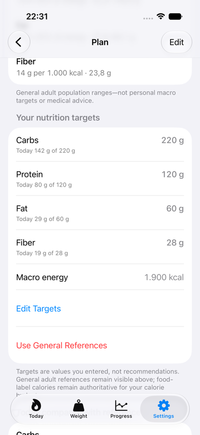

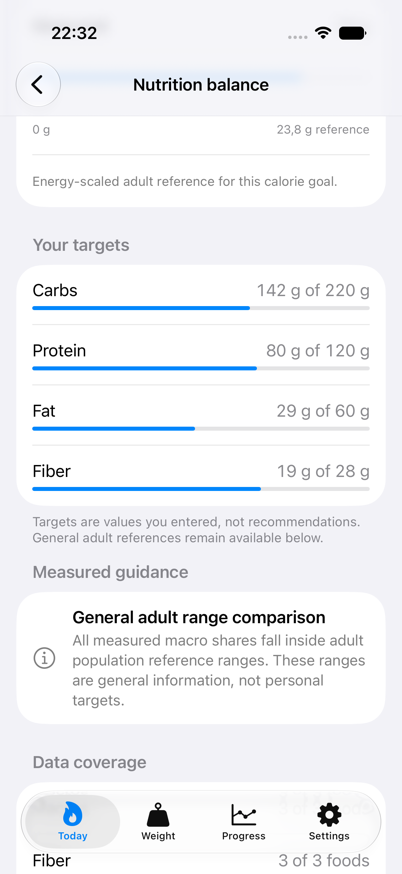

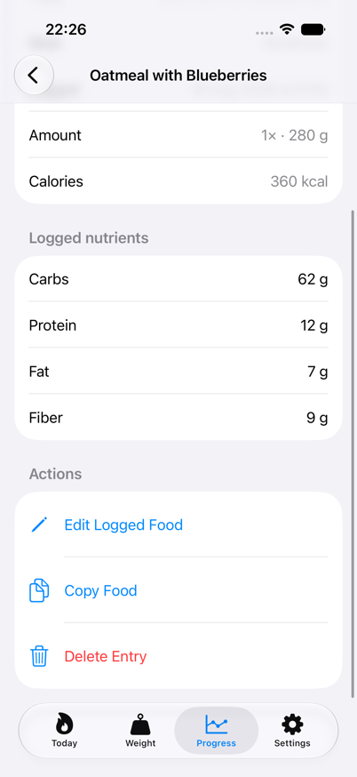

Accessibility 3 dark captures are indexed in [`SCREENSHOTS.md`](SCREENSHOTS.md). Contracts: [`../docs/historical-food-diary-mutation-specification.md`](../docs/historical-food-diary-mutation-specification.md) and [`../docs/personal-nutrition-targets-specification.md`](../docs/personal-nutrition-targets-specification.md).

## Product and safety guarantees

Final closure hardening preserves these invariants:

- iOS 17 minimum remains supported; Foundation Models/Speech paths stay availability-gated with typed/manual fallbacks.
- Language model extracts provisional query/amount structure only. Selected food records own calories and nutrients.
- Food calories are bounded to 0...5,000 per item; nonfinite or unsupported serving math cannot save.
- Invalid legacy calories make Today, meals, history, widget, and Live Activity calorie state visibly incomplete rather than silently low.
- Bulk confirmation requires durable precommit state and one idempotent atomic transaction; no partial insertion.
- Persistent-store failure shows retry instead of deleting data or crashing.
- Reminder replacement generation is assigned synchronously, then serialized, capacity-aware, rollback-capable, authorization-aware, and failure-visible; fresh-context snapshots follow Today, widget-water, diary, and weight writes.
- Missing nutrient facts stay unknown; incomplete or invalid energy suppresses guidance.
- Meal text/audio, learned corrections, and personal nutrition targets remain local and clearable. Bulk flow sends only derived per-row food queries to Open Food Facts; explicit barcode lookup separately sends scanned/entered barcode identifiers under existing API disclosure.
- Historical writes reject future destinations, stale commands, identity collisions, unsupported provenance, invalid scaling, and unconfirmed duplicates before one atomic save. Store-scoped migration preserves prior item editing without promoting unknown aggregates; raw-field undo consumes one-use tombstone, advances mutation generation, and never restores stale attestation.
- General references remain visible beside personal targets; missing nutrient facts never become zero or a false target comparison.

## Independent review

Three independent reviewers received identical neutral criteria and current final diff. They inspected only critical/high user-impact correctness, persistence, nutrition truthfulness, privacy, platform compatibility, reminder/widget/Live Activity, accessibility, and core journeys.

Final result:

```text
Reviewer 1: APPROVE
Reviewer 2: APPROVE
Reviewer 3: APPROVE
```

No unresolved critical/high design or engineering finding remains. Initial diary review and final BACKLOG-CLOSURE-001 review each independently converged at **APPROVE / APPROVE / APPROVE** under identical neutral critical/high criteria. Closure reviewers drove and rechecked migration, CAS, exact undo, reversible density, strict parsing, synchronization ordering, and legacy-truth hardening before final convergence.

A 2026-08-20 follow-up reread all 54 tracked Markdown files, corrected stale/superseded contract wording and evidence paths, mechanically found 0 unchecked tasks or broken local paths, and independently reconverged at **APPROVE / APPROVE / APPROVE** with 0 active/unresolved items. Full record: [`experiments/BACKLOG-CLOSURE-001.md`](experiments/BACKLOG-CLOSURE-001.md).

## Final validation

Current exact-tree gates after BACKLOG-CLOSURE-001:

| Gate | Result |
|---|---|
| `just validate 600` | Passed: 243 hostless executed (241 passed / 2 opt-in live skips); app + widget compile, install, launch passed |
| `just test-app-unit 900` | Passed: 351 passed / 2 opt-in live skips |
| `TEST_CASE_TIMEOUT=60 just test-ui 2400` | Passed: 52/52 functional UI tests |
| `git diff --check` | Passed |

Live Open Food Facts tests remain intentionally opt-in; deterministic mocked/cache/API-contract tests run in normal gates.

### Post-closure production-readiness audit

2026-08-20 test/observability hardening added optimized Release-config app/UI gates, signed archive/signature checks, pure Release bootstrap canary, 55 functional journeys including file-backed relaunch/water/reminder/scanner paths, shared app/widget atomic water core, correlated privacy-safe operational logs, and automatic failure artifacts. Installed iOS 17.5 then exposed and drove fixes for SwiftData explicit-save atomicity, test-schema fidelity, keyboard return, safe-area visibility, and legacy accessibility selectors. Current counts: 254 hostless executed (252 pass / 2 skips), 377 optimized iOS 17 app-hosted pass / 2 skips, 55/55 isolated iOS 17 UI journeys.

This does **not** mark a production candidate approved: local iOS 17 app/UI/archive/pure-Release bootstrap proof is green, but App Store Connect export fails because current team lacks provider/profile-creation permission and matching app/widget App Store profiles. Self-hosted runner variable, required branch/tag check, relevant physical-system smoke, and successful provider-backed IPA export remain external. Full assessment: [`../docs/test-observability-production-readiness-assessment.md`](../docs/test-observability-production-readiness-assessment.md).

## Backlog disposition

No active or deferred project task remains. Historical mutations and personal targets were implemented under separate contracts. HealthKit/account/cross-device sync and other unsupported directions are explicitly rejected from current scope rather than left as proposals. Rejected directions also include LLM-authored nutrition, silent bulk logging, cloud upload of full meal text, scanner-only entry, opaque scores, streak pressure, exercise credits, and reminder windows.

## Evidence map

- Current status: [`STATUS.md`](STATUS.md)
- Visual index: [`SCREENSHOTS.md`](SCREENSHOTS.md)
- Design decisions: [`02-design-log.md`](02-design-log.md)
- Closed decision archive: [`PRODUCT-BACKLOG.md`](PRODUCT-BACKLOG.md)
- Closure experiment: [`experiments/FINAL-001.md`](experiments/FINAL-001.md)
- Post-closure diary experiment: [`experiments/COMPETITOR-GAP-001.md`](experiments/COMPETITOR-GAP-001.md)
- Backlog-closure experiment: [`experiments/BACKLOG-CLOSURE-001.md`](experiments/BACKLOG-CLOSURE-001.md)
- Full completion plan: [`COMPLETION-PLAN.md`](COMPLETION-PLAN.md)
- Test and observability readiness: [`../docs/test-observability-production-readiness-assessment.md`](../docs/test-observability-production-readiness-assessment.md)

## Final decision

**Original redesign, COMPETITOR-GAP-001, and finite Markdown-backlog closure are COMPLETE. No documented implementation queue remains.**
