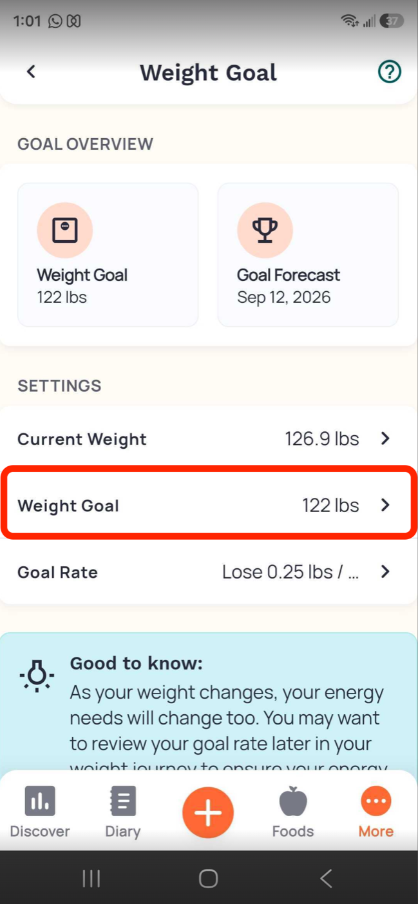
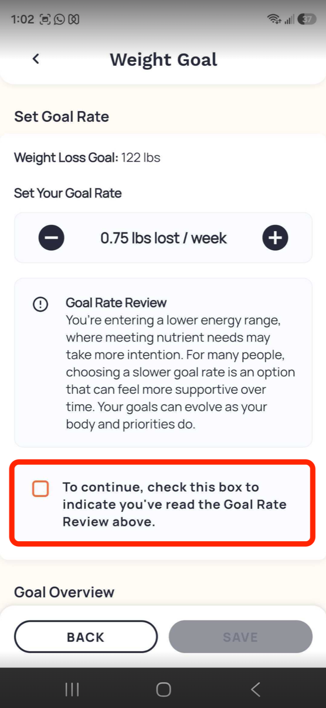
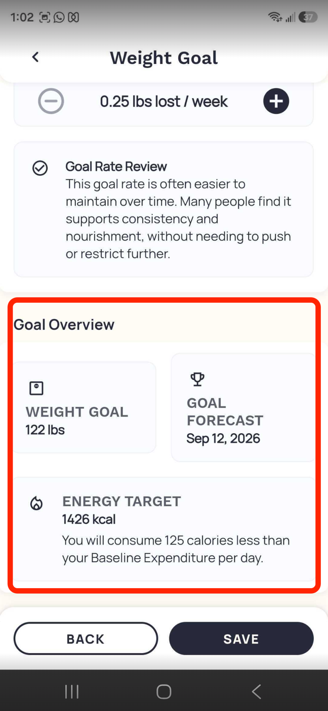
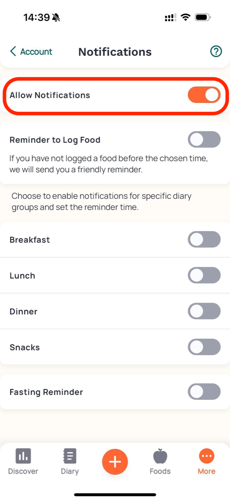
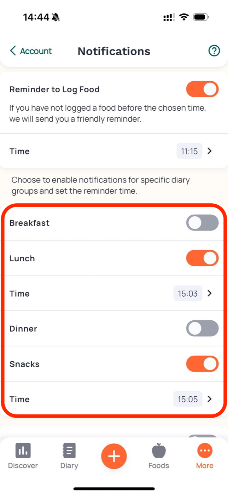
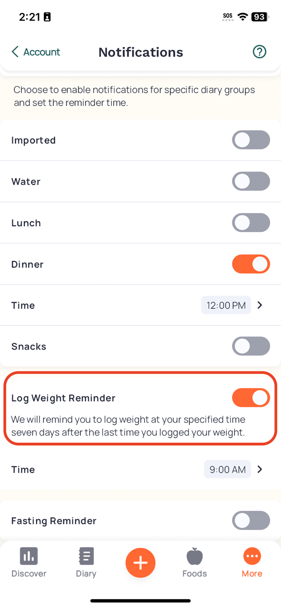

# REFINE-001 plan, Settings, and reminder assessment

Assessment date: 2026-08-10

Archive note: “future” language below records sequencing at research time. REFINE Slices A–D and accepted follow-ups are implemented; this file contains no active proposal.

## Product question

At assessment start, Count Calories asked people to edit age, target weight, a manual calorie goal, target date, and five reminder switches in one flat form. Meal times were hard-coded, notification permission could be denied while switches still looked effective, and the calorie goal had no visible basis. REFINE-001 needed useful control without turning setup into a branded questionnaire or presenting population estimates as medical prescriptions.

This assessment originally covered first coherent Refine slices: native Settings hierarchy, transparent nutrition references derived from the existing manual calorie goal, configurable meal times, and weight reminders. Welcome setup and calculated recommendations were then specified separately in `calculated-plan-specification.md` and accepted as REFINE attempt 02.

## Assessment-start app critique

### Strengths

- Native `NavigationStack`, `Form`, `Section`, `Stepper`, `DatePicker`, and `Toggle` controls.
- Existing reminder planner suppresses a meal after that meal is logged, keeps water independent, uses local calendar dates, and remains below iOS pending-request limit.
- Existing notification manager checks authorization and removes stale app-owned requests.
- Existing nutrient summary preserves unknown facts and gates actual comparisons on complete coverage.

### Problems

1. Flat Settings mixes plan data and operational notifications; frequent scanning cost grows with each feature.
2. `Save settings` applies only profile fields while reminder toggles persist immediately. Mixed commit semantics are not visible.
3. Breakfast/Lunch/Snack/Dinner copy advertises fixed times people cannot change.
4. Turning on a reminder immediately requests permission, but denial leaves enabled-looking toggles without a persistent delivery-status summary.
5. Errors use vague `OK` dismissal rather than an action label.
6. Daily goal is editable but unexplained. Existing values must not be relabeled “calculated.”
7. Target date can imply feasibility even though no rate, body inputs, or safety check supports it.
8. No weight reminder exists despite weight trend depending on repeat measurements.
9. Assessment-start manual calorie goal produced a Fiber reference in Today detail, but no Plan surface showed theoretical macro gram ranges beside actual measured intake.

## Competitor findings

Official product/help sources were accessed 2026-08-10. Product behavior is category evidence, not nutrition authority.

### MacroFactor

Sources:

- [Set a New Goal](https://help.macrofactorapp.com/en/articles/90-set-a-new-goal)
- [Expenditure](https://help.macrofactorapp.com/en/articles/20-expenditure)
- [Weight Trend](https://help.macrofactorapp.com/en/articles/21-weight-trend)
- [Weight logging frequency](https://help.macrofactorapp.com/en/articles/109-how-frequently-do-i-need-to-log-my-weight-for-the-expenditure-algorithm-and-weekly-coaching-updates)
- [Nutrition logging frequency](https://help.macrofactorapp.com/en/articles/110-how-frequently-do-i-need-to-log-my-nutrition-for-the-expenditure-algorithm-and-weekly-coaching-updates)
- [Partially logged days](https://help.macrofactorapp.com/en/articles/29-how-do-macrofactor-s-coaching-algorithms-deal-with-partially-logged-days)
- [Weekly adjustment behavior](https://help.macrofactorapp.com/en/articles/222-how-does-macrofactor-make-adjustments-for-a-weight-gain-or-weight-loss-goal)
- [Strict timelines](https://help.macrofactorapp.com/en/articles/202-what-should-i-do-if-i-m-pursuing-a-goal-with-a-strict-timeline)

Findings:

- Goal setup separates lose/maintain/gain, target weight, rate, summary, and completion. A “green range” gives immediate rate context.
- Trend weight, not one scale reading, drives estimates. Daily or at least three weekly weigh-ins improve trend quality; once weekly is described as practical minimum for coaching.
- Nutrition needs at least four logged days/week and ideally daily. Partial days are treated as materially more dangerous than wholly missing days.
- Adjustments arrive at weekly check-in and require approval. MacroFactor does not slash calories to “catch up” to a missed target date.

Resolved opportunity: attempt 03 preserves raw data, trend evidence, and user-confirmed proposal as separate states. It does not copy dark power-user styling or imply equivalent algorithm quality.

### MyFitnessPal

Sources:

- [Initial goals](https://support.myfitnesspal.com/hc/en-us/articles/360032625391-How-does-MyFitnessPal-calculate-my-initial-goals)
- [Target date](https://support.myfitnesspal.com/hc/en-us/articles/360032271632-Where-can-I-find-my-target-date)
- [Meal reminders](https://support.myfitnesspal.com/hc/en-us/articles/360032622391-Can-you-send-me-a-reminder-if-I-forget-to-log-a-meal)
- [Weight frequency](https://support.myfitnesspal.com/hc/en-us/articles/360032272992-How-often-should-I-record-my-weight-and-other-measurements)
- [Historical goal preservation](https://support.myfitnesspal.com/hc/en-us/articles/360032624071-Can-I-change-my-calorie-goal-without-affecting-my-historical-entries)

Findings:

- Initial estimate asks age, height, weight, sex, ordinary activity, and weekly rate. Goal weight reports distance but does not drive initial calories.
- Product intentionally avoids a durable target date because meeting a date can require an unhealthy rate.
- Reminders use chosen exact time and selected meal/all-meals condition.
- Weight recommendation is weekly under similar conditions because daily scale weight fluctuates.
- Goal changes apply today-forward and preserve past goals.

Resolved opportunity: attempt 02 shows date only as supported estimate/forecast; attempt 03 preserves retained historical goal context.

### Lose It!

Sources:

- [Calorie budget](https://loseit.zendesk.com/hc/en-us/articles/47497714327060-How-the-Calorie-Budget-is-Calculated)
- [Activity level](https://loseit.zendesk.com/hc/en-us/articles/47649203601940-How-to-Change-My-Activity-Level)
- [Start plan](https://loseit.zendesk.com/hc/en-us/articles/47649627723540-How-to-Start-a-New-Weight-Loss-Plan)
- [Projection dates](https://loseit.zendesk.com/hc/en-us/articles/51382148864532-Understanding-Goal-and-Streak-Projection-Dates)
- [Weight gain limitation](https://loseit.zendesk.com/hc/en-us/articles/47773932378260-Can-I-Use-Lose-It-to-Gain-Weight)

Findings:

- Setup uses current/goal weight, physiological inputs, activity, then weekly rate.
- Activity options include concrete movement-distance examples and explicitly exclude optional exercise.
- Planned projection and actual-streak projection are distinguished. Projection hides when pace is extreme or unsupported.
- Gain mode is a workaround rather than a first-class flow.

Resolved opportunity: attempt 02 uses concrete routine examples and makes Maintain and Gain first-class rather than hiding manual math.

### Yazio

Sources:

- [Calorie-goal calculation](https://help.yazio.com/hc/en-us/articles/4410156873233-How-does-Yazio-calculate-my-calorie-goal)
- [Activity examples](https://help.yazio.com/hc/en-us/articles/360005363638-Which-activity-level-should-I-choose)
- [Reminders](https://help.yazio.com/hc/en-us/articles/4406890595601-Set-Up-Reminders-in-Yazio)
- [Adjust goals](https://help.yazio.com/hc/en-us/articles/29832253731857-How-can-I-adjust-my-goals)

Findings:

- Public explanation names Mifflin–St Jeor, required inputs, activity factors, and energy adjustment.
- Activity labels include work-routine examples and warn against double-counting tracker steps.
- Meal reminders use independently chosen exact times. Weigh-in reminder supports daily or weekly frequency plus time.
- Weekly change is capped at 1 kg. Manual calorie and macro controls remain available.

Resolved opportunity: attempt 01 uses exact meal times plus explicit Daily/Weekly weight cadence; unsupported reminder windows are rejected.

### Lifesum

Sources:

- [Change goal](https://help.lifesum.com/en/article/how-do-i-change-my-goal-1ow4ip1/)
- [Maintain mode](https://help.lifesum.com/en/article/can-i-use-lifesum-to-maintain-my-weight-z6naxb/)
- [Calorie minimum explanation](https://help.lifesum.com/en/article/why-we-recommend-our-users-to-stay-above-a-certain-calorie-number-of-calories-per-day-moyc1/)
- [iOS notification settings](https://help.lifesum.com/en/article/how-can-i-manage-push-notifications-on-my-phone-ios-33fnrk/)

Findings:

- Goal changes are a focused flow under Profile/Personal Details.
- Maintain mode is explicit.
- Product describes Mifflin–St Jeor plus activity and rejects goals below its individualized recommendation, but does not publish one universal safe personal target.
- In-app notification controls coexist with system notification permission.

Resolved opportunity: attempt 01 keeps system delivery authorization distinct from saved app reminder preference and exposes denied recovery.

### Cronometer

Sources:

- [Targets + Profile](https://support.cronometer.com/hc/en-us/articles/31308427612180-Targets-Profile)
- [Energy Target](https://support.cronometer.com/hc/en-us/articles/31975503009044-Energy-Target)
- [Weight Goal](https://support.cronometer.com/hc/en-us/articles/32978027080980-Mobile-Weight-Goal)
- [Notifications](https://support.cronometer.com/hc/en-us/articles/360051718511-Mobile-Notifications)

Findings:

- Profile, energy, weight goal, macro targets, and reset defaults live in one settings hierarchy.
- Weight-goal flow shows rate, low-energy review, forecast, target, and energy deficit/surplus before Save.
- Meal/group reminders use exact time and only fire when matching food has not been logged.
- Weight reminder fires seven days after last weight.

Retained official-help screenshots:













Resolved opportunity: focused Settings editors use hierarchy, review-before-save, and conditional timing without dense branded cards or acknowledgment in place of safety validation.

### Foodnoms

Sources:

- [Automatic calorie goal](https://foodnoms.com/help/automatic-calorie-goal)
- [Calibrated Energy](https://foodnoms.com/help/calibrated-energy)
- [Macro goals](https://foodnoms.com/help/macro-goals)
- [Body Profile](https://foodnoms.com/help/body-profile)
- [Create and edit goals](https://foodnoms.com/help/create-and-edit-goals)

Findings:

- Automatic budget separates expenditure from weight goal and exposes a calculation breakdown; static target remains available.
- Macro goals derived from calorie goal recalculate with it; manual and advanced alternatives remain available.
- Goal changes apply today-forward.
- Calibrated Energy is inspectable, uses recent food/weight evidence, rejects partial days, smooths weight, opens no more than weekly, ignores small differences, caps one proposal, and never applies automatically.

Resolved opportunity: NUTRITION-GOALS-001 recalculates transparent references; attempt 03 implements explicit evidence/status/proposal/revert states without black-box claims.

## Category decisions

1. **Exact meal times, not windows, for first version.** MyFitnessPal, Yazio, and Cronometer all expose exact time. No inspected source shows that a reminder window gives people more useful control. Exact times are deterministic across UI, notification scheduling, and VoiceOver.
2. **Independent reminder conditions.** Breakfast, Lunch, Snack, Dinner, Weight, and Water keep separate preferences.
3. **Meal suppression remains semantic.** A reminder fires only when matching meal has not been logged that local day.
4. **Weight cadence offers Daily or Weekly.** Daily uses selected time. Weekly schedules after seven days without a weight, at selected time; a new weight resets due date.
5. **No adaptive calorie change in Slices A/B.** Research supported waiting for trend and logging evidence, then showing a user-confirmed proposal. Attempt 03 later added plan history and data-quality state under its separate contract.
6. **Existing calorie goal is Manual.** Migration preserves value exactly; it is never retroactively labeled calculated.
7. **References are not personal macro prescriptions.** First Plan surface shows general adult ranges and measured actuals only with complete relevant coverage.

## Apple UX/UI guidance

Reviewed through Xcode Documentation Search on 2026-08-10:

- [Onboarding](https://developer.apple.com/design/human-interface-guidelines/onboarding): prerequisite onboarding should be brief; teach through interaction; avoid making people memorize excess information; optional tutorial remains available later.
- [Entering data](https://developer.apple.com/design/human-interface-guidelines/entering-data): ask only for needed data, offer choices instead of typing where possible, prefill reasonable values, validate dynamically, and enable continuation only when required data is valid.
- [Settings](https://developer.apple.com/design/human-interface-guidelines/settings): use strong defaults, minimize settings, avoid duplicating systemwide settings, and use a dedicated settings interface appropriate to change frequency.
- [Layout](https://developer.apple.com/design/human-interface-guidelines/layout): put important content first, group controls logically, and use progressive disclosure rather than crowding one screen.
- [Writing](https://developer.apple.com/design/human-interface-guidelines/writing): one purpose per screen, action-oriented labels, consistent Next/Done language, simple setting labels, and errors near the problem with a clear recovery.
- [Notifications](https://developer.apple.com/design/human-interface-guidelines/notifications): notifications should be timely, concise, high-value, nonsensitive, and not duplicated.
- [Asking permission to use notifications](https://developer.apple.com/documentation/usernotifications/asking-permission-to-use-notifications): request in context after a person schedules the first reminder, not automatically at launch.
- [HealthKit privacy](https://developer.apple.com/design/human-interface-guidelines/healthkit#Privacy-protection): request only needed health access in context and use system permission management; no HealthKit integration is added in this slice.
- [Accessibility](https://developer.apple.com/design/human-interface-guidelines/accessibility) and [Buttons](https://developer.apple.com/design/human-interface-guidelines/buttons): use familiar controls, adapt to Dynamic Type/appearance, provide non-color meaning, and keep hit regions at least 44 × 44 pt.

Resulting design:

- Settings root becomes native `Form` hierarchy with concise summaries.
- Detail screens disclose Plan, Profile, and Reminders separately.
- Each editable detail uses one consistent explicit Save/Cancel transaction; no field persists before Save.
- Notification permission appears only after Save expresses first enabled reminder intent.
- Denial keeps preference distinct from delivery and shows direct system-settings recovery.
- Standard `Form`, `NavigationStack`, `NavigationLink`, `Toggle`, `DatePicker`, `Picker`, `Stepper`, buttons, semantic styles, and Dynamic Type remain primary.

## Nutrition and safety sources

Authoritative sources:

- CDC, [Steps for Losing Weight](https://www.cdc.gov/healthy-weight-growth/losing-weight/index.html): gradual loss around 1–2 lb/week is more likely to be maintained; unrealistic goals can be discouraging; health professionals can support safe change.
- NIDDK, [Body Weight Planner](https://www.niddk.nih.gov/bwp): adult-only scope; excludes pregnancy/breastfeeding; warns below healthy BMI; rejects goals below 1,000 kcal/day because food-group/nutrient recommendations cannot be met.
- Mifflin et al., [A new predictive equation for resting energy expenditure in healthy individuals](https://pubmed.ncbi.nlm.nih.gov/2305711/): equation derived from 498 adults aged 19–78, including normal-weight and obese participants; `R² = 0.71`; uses weight, height, age, and sex.
- National Academies, [Dietary Reference Intakes for Energy](https://nap.nationalacademies.org/catalog/26818/dietary-reference-intakes-for-energy) and [macronutrient/fiber DRI](https://doi.org/10.17226/10490).

Safety interpretation:

- Mifflin–St Jeor is an estimate for adults, not a diagnosis or universal prescription.
- Implemented calculator asks every required input and explains equation scope; it never silently infers equation constant, height, activity, pregnancy/lactation, or clinical status.
- Implemented target-date UI rejects infeasible rates rather than lowering calories to satisfy date.
- Hard lower bound cannot be below 1,000 kcal/day for supported adults. A higher individualized recommendation may be appropriate; this remains a specification question, not a value to guess.
- Children, pregnancy/lactation, eating-disorder care, and medically prescribed diets remain outside automated recommendation scope.
- Slice A performed no energy-needs calculation and introduced no new personal calorie recommendation; later calculated/adaptive slices used separate explicit contracts.

## NUTRITION-GOALS-001 formula

For a positive finite manual calorie goal `C`:

```text
carbohydrate range = C × 45–65% ÷ 4 kcal/g
protein range      = C × 10–35% ÷ 4 kcal/g
fat range          = C × 20–35% ÷ 9 kcal/g
fiber reference    = C × 14 g ÷ 1,000 kcal
```

Rules:

- Keep full precision in domain; round only for display.
- Reject nonpositive/nonfinite/out-of-domain calorie goals.
- Show percent and gram basis together.
- Recalculate live in Plan draft, but persist only on Save.
- Food-label calories remain authoritative. The colored macro-only split normalizes 4/4/9 energy across carbohydrate/protein/fat, while adult-range comparison divides each macro’s estimated energy by reported logged calories; these are intentionally separate denominators.
- Today’s actual percentage/reference comparison requires 100% macro coverage and positive reported logged calories; Fiber comparison requires 100% Fiber coverage.
- Partial known grams remain visible with exact `known/entry` coverage and “comparison paused”; missing facts never become zero.

Example at 1,700 kcal:

| Nutrient | Reference | Derived grams |
| --- | ---: | ---: |
| Carbohydrate | 45–65% | 191.25–276.25 g |
| Protein | 10–35% | 42.5–148.75 g |
| Fat | 20–35% | 37.78–66.11 g |
| Fiber | 14 g/1,000 kcal | 23.8 g |

## Reminder data model and state machine

### Persisted preferences

- enabled flags: Breakfast, Lunch, Snack, Dinner, Water, Weight;
- meal minute-of-day for each meal, defaulting to current 09:00, 13:00, 16:00, 20:00 behavior;
- weight cadence: Daily or Weekly;
- weight minute-of-day, default 09:00.

All values use `UserDefaults` because they are app preferences, not historical health records. Unknown/invalid legacy time values fall back independently to defaults.

### Editor states

```text
loaded draft
  ├─ Cancel → discard draft; no permission request; no reschedule
  └─ Save
       ├─ persist preference transaction
       ├─ no enabled reminders → clear app-owned pending requests
       └─ enabled reminders
            ├─ not determined → request system authorization in context
            ├─ authorized → schedule
            ├─ denied → retain selected preference + show blocked delivery/recovery
            └─ request/schedule error → explain failure; preserve recoverable draft/preference
```

App preference and system delivery authorization are distinct. UI must say “Selected · notifications off” when denied, never simply “On.”

### Planner rules

- Build dates with provided local `Calendar`; never fixed UTC arithmetic.
- Schedule only future dates.
- Meal plans cover five local days, preserving current pending-request budget.
- Matching meal record suppresses only that meal on that local day.
- Daily weight reminder covers five days but skips any day with a weight entry.
- Weekly weight reminder fires at chosen local time once seven days have elapsed since latest valid weight; a recent weight resets due date. If no weight exists, schedule next available chosen time.
- Water remains every two hours from 08:00 through 22:00, starts from latest glass, stops at eight glasses, and remains independent.
- Sort deterministically by fire date then identifier.
- Cap generated requests at 64 even if future reminder types expand.
- Notification copy contains no calorie, weight, or food value visible on Lock Screen.

## Migration

- Existing `UserProfile.dailyCalorieGoal`, target weight/date, and age remain byte-for-value unchanged.
- Existing reminder booleans remain unchanged.
- Missing time keys use old advertised defaults, preserving behavior.
- Weight reminder defaults off.
- No existing goal is marked calculated.
- Logged food, nutrient snapshots, weight records, widget data, and Live Activity behavior remain untouched by this slice.

## Privacy

- Plan/reference calculations occur on device.
- Reminder content exposes no sensitive numeric health values.
- Notification authorization is requested only after direct reminder intent.
- No HealthKit access, account, analytics upload, or new network request is introduced.

## Acceptance rules

1. Settings root clearly separates Plan, Profile, and Reminders with useful summaries.
2. Every detail edits through Save/Cancel; cancel changes nothing.
3. Existing 1,700-kcal profile remains a manual 1,700-kcal goal after migration.
4. Plan shows all four calorie-goal-derived references with exact tested formulas.
5. Complete actuals compare beside references; partial actuals remain known but comparisons pause.
6. Each meal reminder has independent enabled state and exact time.
7. Weight reminder supports Daily/Weekly and resets after matching weight evidence.
8. Notification denial is visible with direct Settings recovery; preference never masquerades as delivery.
9. Planner remains local-calendar/DST aware, future-only, deterministic, and at most 64 requests.
10. Normal, dark, Accessibility Dynamic Type, denied, empty/partial, and small-device states receive rendered review.
11. Focused domain tests, app compile, exact-tree `just validate`, and final UI suite pass or external infrastructure blocker is reported separately.

## Implementation result

REFINE-001 attempt 01 accepted Slices A/B on 2026-08-10. Existing goals remain Manual; Plan/Profile/Reminders use explicit transactions; references, exact meal times, Daily/Weekly weight reminders, independent water behavior, contextual authorization, denied recovery, and authorization-return rescheduling are implemented. AMDR guidance uses reported logged calories as denominator while the colored macro-only split remains separately normalized.

User-requested WEIGHT-ENTRY-001 follow-up is also accepted: latest valid measurement defaults, `−1/−0.1/+0.1/+1` controls, and native keyboard Done across every numeric pad. Attempt-01 gates were 155 hostless pass / 2 live skips, 184 app-hosted pass / 2 live skips, exact-tree simulator validation passed, and functional UI 14/14.

REFINE attempt 02 added optional calculated setup, Manual/Calculated source, transparent breakdown, override/restore, and direct reminder/Plan entry. Its integrated gates were 178 hostless pass / 2 skips, 210 app-hosted pass / 2 skips, exact-tree validation passed, and functional UI 22/22.

REFINE attempt 03 completed evidence-gated adaptive check-ins, proposal/apply/decline/disable/revert, retained goal history, and fail-closed provenance. BACKLOG-CLOSURE-001 later completed optional personal nutrition targets while retaining general references. Unsupported reminder windows and HealthKit/account sync are explicitly rejected from current scope. No assessment item remains open.
